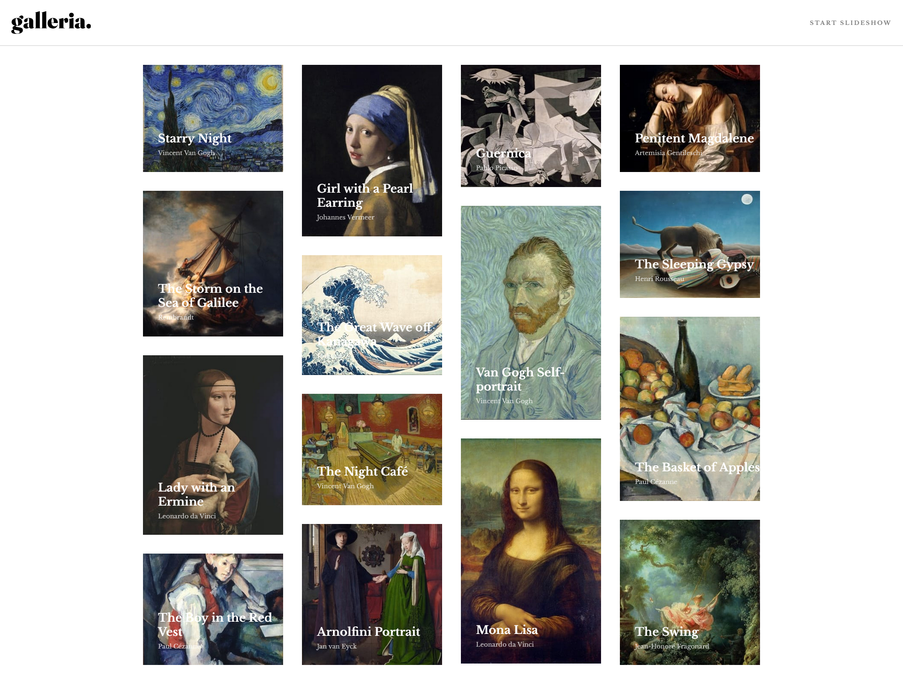
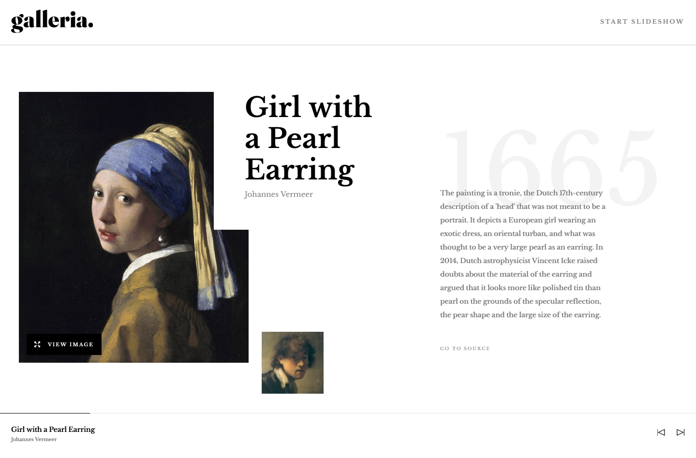

# Galleria Slideshow Site - Thomas Sifferle 🖼️


[](https://github.com/TomSif)
[](https://reactjs.org/)
[](https://vitejs.dev/)
[](https://tailwindcss.com/)
[](https://www.typescriptlang.org/)
[](https://reactrouter.com/)
[](https://www.framer.com/motion/)



### 🌐 Live Demo:

**[View live site →](https://front-end-mentor-galleria-slide-sho.vercel.app/)**

Deployed on Vercel with HTTPS and performance optimizations.

---

This is a solution to the [Galleria slideshow site challenge on Frontend Mentor](https://www.frontendmentor.io/challenges/galleria-slideshow-site-tEA4pwsa6). Frontend Mentor challenges help you improve your coding skills by building realistic projects.

## Table of contents

- [Overview](#overview)
  - [The challenge](#the-challenge)
  - [Screenshot](#screenshot)
  - [Links](#links)
- [My process](#my-process)
  - [Built with](#built-with)
  - [What I learned](#what-i-learned)
  - [Continued development](#continued-development)
- [Author](#author)
- [Acknowledgments](#acknowledgments)

## Overview

### The challenge

Users should be able to:

- View the optimal layout for the app depending on their device's screen size
- See hover states for all interactive elements on the page
- Navigate the slideshow and view each painting in a lightbox

### Screenshot



### Links

- Solution URL: [GitHub Repository](https://github.com/TomSif/Front-end_Mentor_Galleria_Slide-show)
- Live Site URL: [Vercel Deployment](https://front-end-mentor-galleria-slide-sho.vercel.app/)

## My process

### Built with

- Semantic HTML5 markup
- CSS custom properties
- CSS Grid + Subgrid
- Mobile-first workflow
- [React 19](https://react.dev/) - JS library
- [TypeScript](https://www.typescriptlang.org/)
- [Vite](https://vite.dev/) - Build tool
- [Tailwind CSS v4](https://tailwindcss.com/) - Utility-first CSS (`@tailwindcss/vite` plugin, `@theme` variables, `@utility` presets)
- [React Router](https://reactrouter.com/) - Client-side routing
- [Framer Motion](https://www.framer.com/motion/) - Animations

### What I learned

#### Masonry layout — a backtracking algorithm

The homepage grid isn't a standard CSS Grid layout — it's a true masonry with blocks of varying heights across 4 columns. After measuring all 15 thumbnails, I discovered the designer had calibrated them so that each column totals exactly 1390px in height. No CSS-only solution or community approach handled this perfectly.

I built a **backtracking algorithm with round-robin priority**: for each item, it first tries its natural column (`index % cols`), then falls back to others, pruning any branch that would exceed the target height. The result matches the Figma mockup exactly at all three breakpoints (1, 2, and 4 columns), with a round-robin fallback for safety if the data changes.

```ts
// The core idea: try the round-robin column first, then explore alternatives
const preferredCol = index % cols;
const order = [preferredCol, ...otherCols];
for (const col of order) {
  if (colHeights[col] + item.height <= target) {
    // place item, recurse, backtrack if needed
  }
}
```

This was a genuine problem-solving highlight — the insight that triggered the solution (equal column heights) came from visual analysis of the design, not from code.

#### Native `<dialog>` for the lightbox

Instead of building a custom modal with portals and manual focus trapping, I used the native HTML `<dialog>` element with `.showModal()` / `.close()`. It provides built-in focus trap, `Escape` key handling, and backdrop styling. One gotcha: Tailwind's preflight resets break the default `display: none` on closed dialogs — fixed with `dialog:not([open]) { display: none }` in `index.css`.

#### Framer Motion — scoped animations

Key takeaway: `AnimatePresence` should wrap only the animated element (here `<motion.main>` with a `key` based on the slug), not the entire app. Each animation prop (`initial`, `animate`, `exit`) needs its own `transition` — putting it only in `animate` won't apply to `exit`. Stagger animations on the homepage cards used `variants` with `staggerChildren` on the parent `motion.ul`.

#### React patterns consolidated

- **`useOutletContext`** to share state from `Layout` to route children via `<Outlet context={...} />` — lighter than Context or Redux for simple cases.
- **`useLocation` state** to persist the lightbox open/closed state across route navigations.
- **Custom `useColumns` hook** with `resize` listener + cleanup, returning 1, 2, or 4 columns based on viewport width.
- **`Dispatch<SetStateAction<T>>`** as the proper type for useState setters passed as props.

### Continued development

- **Backtracking & recursion** — I understand the pattern (base case → choose → recurse → undo) but can't write it from scratch yet. Next goal is to recognize and apply it independently.
- **TypeScript discipline** — caught myself typing a boolean state as `string` (`"small"` instead of `true`). The `is` prefix convention should always map to `boolean`.
- **Layout architecture** — this project reinforced that negative margins in the document flow are more maintainable than `absolute` + `translate` for editorial overlaps. I want to keep refining this instinct.

## Author

- Frontend Mentor - [@TomSif](https://www.frontendmentor.io/profile/TomSif)
- GitHub - [@TomSif](https://github.com/TomSif)

## Acknowledgments

This project was built with AI-assisted mentoring (Claude). The approach: I code by hand, Claude acts as a Socratic mentor — asking questions, explaining concepts, reviewing my reasoning. When I got stuck, Claude helped me explore solutions, but key insights (like the equal-height columns observation that unlocked the masonry algorithm) came from my own analysis of the design.

Specific AI contributions are documented transparently in my [progression log](./progression.md):

- **Written by Claude:** `solveMasonry.ts` (backtracking algorithm), `useColumns.ts` hook, Python verification script
- **My initiative:** The equal-height observation, all thumbnail measurements, visual testing, architectural decisions (where to place state, when to use context vs props)
- **Collaborative:** Exploring different approaches (round-robin, shortest-column-first, CSS columns, community solutions), debugging, code review
